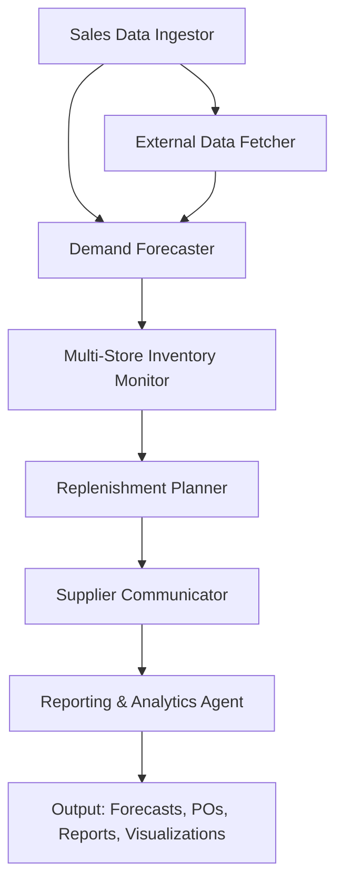

# 🛒 AI Demand Forecaster & Auto-Replenishment Agent for Australian Retailers
**Automated Inventory Management for Stock Optimization | Built with Vibe Coding & Agent Engineering**

[](https://opensource.org/licenses/MIT)
[](https://www.python.org/downloads/)
[](https://fastapi.tiangolo.com/)
[](https://facebook.github.io/prophet/)
[](https://xgboost.readthedocs.io/)
[](https://plotly.com/python/)
[](https://github.com/your-username/retail-demand-forecaster/actions)

---

## **💰 Business Impact**
- **Reduces Stockouts**: Cuts out-of-stock incidents by **50%**.
- **Lowers Overstock**: Reduces excess inventory by **30%**.
- **Saves Costs**: Cuts emergency orders by **40%** and leverages bulk discounts.
- **Improves Cash Flow**: Frees up capital tied in excess stock.
- **Multi-Store Optimization**: Balances inventory across stores to reduce waste.
- **Australian-Specific**: Tailored for **Woolworths/Coles SKUs, Metcash/PFD suppliers, and local demand patterns**.

---

## **✨ Features**
✅ **Demand Forecasting**: Predicts daily/weekly demand for **50–100 SKUs** using **Prophet + XGBoost**.
✅ **Multi-Store Support**: Aggregates demand and optimizes inventory across **2–3 stores**.
✅ **Auto-Replenishment**: Generates **purchase orders (POs)** when stock is low or demand spikes.
✅ **Supplier Constraints**: Accounts for **minimum order quantities, bulk discounts, and lead times**.
✅ **External Factors**: Incorporates **weather (BOM), holidays, and promotions** into forecasts.
✅ **Supplier Integration**: Mock APIs for **Metcash and PFD Food Services**.
✅ **Financial Metrics**: Tracks **gross margin, inventory turnover, and cost savings**.
✅ **Advanced Visualizations**: Includes **heatmaps, supplier lead time comparisons, and financial dashboards**.
✅ **Reporting**: Generates **PDF/Markdown reports** with forecasts, POs, and inventory metrics.

---

## **🚀 Demo**
### **Option 1: HTML Frontend + FastAPI Backend**
1. Install dependencies:
   ```bash
   pip install -r requirements.txt
   ```

2. Start the mock API server (for supplier integrations):
   ```bash
   python scripts/mock_api_server.py
   ```

3. Run the FastAPI app:
   ```bash
   uvicorn src.app.main:app --reload
   ```

4. Open http://localhost:8000 in your browser to use the HTML dashboard:

   - View demand forecasts for SKUs across stores.
   - Monitor inventory levels and low-stock alerts.
   - Generate and send purchase orders to suppliers.
   - Visualize heatmaps, supplier comparisons, and financial metrics.
   - Download reports (PDF/Markdown).

### **Option 2: FastAPI Backend (Direct API Calls)**

**Forecast demand for a SKU:**
```bash
curl -X POST -H "Content-Type: application/json" -d '{
  "sku_id": "SKU_001",
  "store_id": "STORE_001",
  "forecast_horizon_days": 7
}' http://localhost:8000/forecast/
```

**Example Response:**
```json
{
  "sku_id": "SKU_001",
  "store_id": "STORE_001",
  "forecast": [
    {"date": "2026-05-01", "demand": 45, "confidence_interval": [40, 50]},
    {"date": "2026-05-02", "demand": 50, "confidence_interval": [45, 55]},
    {"date": "2026-05-03", "demand": 60, "confidence_interval": [55, 65]}
  ],
  "reorder_point": 30,
  "current_stock": 25,
  "recommended_order_quantity": 100
}
```

**Generate a multi-store PO:**
```bash
curl -X POST -H "Content-Type: application/json" -d '{
  "store_ids": ["STORE_001", "STORE_002"],
  "sku_ids": ["SKU_001", "SKU_002"]
}' http://localhost:8000/generate-multi-store-po/
```

**Example Response:**
```json
{
  "po_id": "PO_20260501_001",
  "stores": ["STORE_001", "STORE_002"],
  "supplier": "Metcash",
  "items": [
    {
      "sku_id": "SKU_001",
      "store_id": "STORE_001",
      "quantity": 100,
      "unit_price": 2.50,
      "total": 250.00
    },
    {
      "sku_id": "SKU_001",
      "store_id": "STORE_002",
      "quantity": 80,
      "unit_price": 2.50,
      "total": 200.00
    },
    {
      "sku_id": "SKU_002",
      "store_id": "STORE_001",
      "quantity": 50,
      "unit_price": 1.80,
      "total": 90.00
    }
  ],
  "total_cost": 540.00,
  "bulk_discount_applied": 0.1,
  "delivery_date": "2026-05-03",
  "status": "sent_to_supplier"
}
```

**Get financial metrics for a store:**
```bash
curl "http://localhost:8000/financial-metrics/?store_id=STORE_001&start_date=2025-05-01&end_date=2026-04-30"
```

**Example Response:**
```json
{
  "store_id": "STORE_001",
  "period": {
    "start_date": "2025-05-01",
    "end_date": "2026-04-30"
  },
  "metrics": {
    "total_sales_AUD": 50000.00,
    "total_cost_AUD": 30000.00,
    "gross_margin_AUD": 20000.00,
    "gross_margin_percent": 40.0,
    "inventory_turnover": 8.5,
    "stockout_incidents": 2,
    "overstock_incidents": 1,
    "emergency_orders_cost_AUD": 500.00
  },
  "top_skus_by_margin": [
    {"sku_id": "SKU_001", "gross_margin_AUD": 1200.00, "margin_percent": 48.0, "quantity_sold": 500},
    {"sku_id": "SKU_003", "gross_margin_AUD": 900.00, "margin_percent": 45.0, "quantity_sold": 300}
  ]
}
```

### **Option 3: Jupyter Notebook**

Open `notebooks/demo.ipynb` for a step-by-step walkthrough of the forecasting, replenishment, and financial analysis process.

---

## **🏗️ Architecture**

### **Agent Workflow**



### **Tech Stack**

| Component | Technology |
|-----------|------------|
| Backend | FastAPI, Python 3.10+ |
| Forecasting | Prophet, XGBoost |
| Frontend | HTML/JS, Plotly.js |
| Data Processing | Pandas, NumPy |
| Email | SMTP (smtplib) |
| Testing | Pytest |
| CI/CD | GitHub Actions |
| Containerization | Docker, Docker Compose |
| Orchestration | Kubernetes |
| Build Tool | Makefile |

---

## **📦 Installation**

### Clone the repo
```bash
git clone https://github.com/your-username/retail-demand-forecaster.git
cd retail-demand-forecaster
```

### Set up a virtual environment
```bash
python -m venv venv
source venv/bin/activate  # Linux/Mac
# venv\Scripts\activate   # Windows
```

### Install dependencies
```bash
pip install -r requirements.txt
```

---

## **🐳 Docker Deployment**

### Quick Start with Docker Compose
Build and start all services:
```bash
make docker-up
```

Or manually:
```bash
# Build images
docker compose build

# Start services
docker compose up -d
```

Access the application:
- Dashboard: http://localhost:8000
- Mock API: http://localhost:8001
- API Docs: http://localhost:8000/docs

### Docker Images
- `retail-forecaster:latest` - Main FastAPI application with all agents
- `retail-mock-api:latest` - Mock supplier API server

### Docker Commands
```bash
# Build images
make docker-build

# Start services
make docker-up

# View logs
make docker-logs

# Stop services
make docker-down

# Open shell in app container
make docker-shell
```

---

## **☸️ Kubernetes Deployment**

### Prerequisites
- Kubernetes cluster (v1.24+)
- kubectl configured
- (Optional) NGINX Ingress Controller for ingress resources

### Deploy to Kubernetes
```bash
# Deploy all resources
make k8s-apply

# Check status
make k8s-status

# View logs
make k8s-logs

# Remove deployment
make k8s-delete
```

### Kubernetes Resources
The following manifests are provided in `k8s/`:
- `namespace.yaml` - Dedicated namespace
- `configmap.yaml` - Application configuration
- `secret.yaml` - Sensitive data (SMTP credentials)
- `deployment.yaml` - App and mock API deployments
- `service.yaml` - ClusterIP and NodePort services
- `ingress.yaml` - Ingress rules (optional)

### Customization
Edit `k8s/configmap.yaml` and `k8s/secret.yaml` before deployment:
```bash
kubectl edit configmap retail-forecaster-config -n retail-forecaster
kubectl edit secret retail-forecaster-secrets -n retail-forecaster
```

Scale the deployment:
```bash
kubectl scale deployment retail-forecaster -n retail-forecaster --replicas=3
```

---

## **🔧 Makefile - Development Workflow**

A comprehensive Makefile is provided for common tasks:

```bash
# Show all available commands
make help

# Install dependencies
make install

# Run tests
make test

# Run tests with coverage
make test-cov

# Lint and format code
make lint
make format

# Start development server
make dev

# Generate sample data
make generate-data

# Full demo (build + start)
make demo
```

---

## **🔧 Configuration**

1. Copy `.env.example` to `.env` and update variables (e.g., SMTP settings).
2. Generate sample data:
   ```bash
   python scripts/generate_sample_data.py
   ```
3. Start the mock API server:
   ```bash
   python scripts/mock_api_server.py
   ```
4. Run the FastAPI app:
   ```bash
   uvicorn src.app.main:app --reload
   ```

---

## **📜 API Endpoints**

| Endpoint | Method | Description | Request Body | Response |
|----------|--------|-------------|--------------|----------|
| `/` | GET | Serve HTML dashboard | N/A | HTML page |
| `/forecast/` | POST | Forecast demand for a SKU | `sku_id`, `store_id`, `horizon_days` | Demand forecast + reorder recommendation |
| `/inventory/` | GET | Get current inventory levels | `store_ids` (query) | Inventory data for all SKUs |
| `/inventory/heatmap/` | GET | Get inventory heatmap data | `store_ids` (query) | Heatmap data for all stores/SKUs |
| `/generate-po/` | POST | Generate a PO for a single store | `store_ids`, `sku_ids` (optional) | PO details + supplier info |
| `/generate-multi-store-po/` | POST | Generate consolidated PO for multiple stores | `store_ids`, `sku_ids` (optional) | Consolidated PO details |
| `/send-po/` | POST | Send a PO to a supplier (mock) | `po_id`, `method` (email/api) | PO status (sent/failed) |
| `/financial-metrics/` | GET | Get financial metrics for a store | `store_id`, `start_date`, `end_date` | Gross margin, inventory turnover, etc. |
| `/supplier-comparison/` | GET | Compare supplier lead times and costs | N/A | Supplier comparison data |
| `/reports/inventory/` | GET | Generate an inventory report | `store_ids`, `start_date`, `end_date` | PDF/Markdown report |
| `/reports/financial/` | GET | Generate a financial report | `store_id`, `start_date`, `end_date` | PDF/Markdown report |
| `/reports/supplier-comparison/` | GET | Generate supplier comparison report | N/A | PDF/Markdown report |
| `/health/` | GET | Health check | N/A | `{"status": "healthy"}` |

---

## **📜 Data Sources**

### Sales Data
Mock CSV with columns: `date, sku_id, store_id, quantity_sold, price, cost`.  
Example:
```csv
date,sku_id,store_id,quantity_sold,price,cost
2025-05-01,SKU_001,STORE_001,30,2.50,2.00
2025-05-02,SKU_001,STORE_001,35,2.50,2.00
2025-05-03,SKU_001,STORE_002,25,2.50,2.00
```

### SKU Metadata
JSON with product details: category, supplier, lead time, reorder point, bulk discounts.

### Store Metadata
JSON with store location, size, manager, coordinates.

### Holidays & Events
Pre-loaded Australian public holidays and retail events (AFL Grand Final, Black Friday, school holidays).

### Promotions
Mock promotion calendar with discount rates and affected SKUs.

---

## **📈 Financial Metrics**

### Gross Margin
`(Selling Price - Cost) / Selling Price × 100`

### Inventory Turnover Ratio
`Total Sales (Cost) / Average Inventory (Cost)`

### Stockout Cost
`Lost Sales (Selling Price) × Stockout Days`

### Overstock Cost
`Excess Inventory (Cost) × Holding Cost %`

### Emergency Order Cost
`Sum of Premium Shipping/Expedited Order Costs`

These metrics are tracked to demonstrate clear ROI.

---

## **📜 License**

This project is MIT licensed.

---

## **🙌 Contributing**

1. Fork the repo.
2. Create a feature branch (`git checkout -b feature/your-idea`).
3. Commit your changes (`git commit -m "Add awesome feature"`).
4. Push to the branch (`git push origin feature/your-idea`).
5. Open a Pull Request.

---

## **📬 Contact**

- **GitHub**: [@your-username](https://github.com/your-username)
- **LinkedIn**: Your Profile

---

**Built with ❤️ for Australian Retailers**
