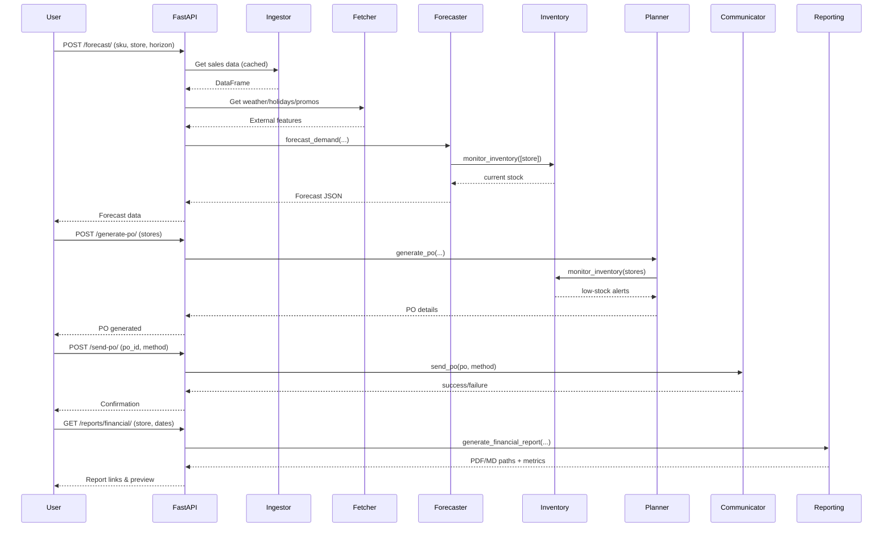

# Agent Workflow

## End-to-End Request Journey

This document walks through a typical request: **"Forecast demand for SKU_001 at STORE_001 for the next 7 days and generate a purchase order if stock is low."**

### Step 1: Forecast Demand

1. Frontend or CLI sends a `POST /forecast/` request with `sku_id`, `store_id`, `horizon_days`.
2. FastAPI routes the request to `get_forecast()` in `src/app/main.py`.
3. `forecast_demand()` from the Demand Forecaster agent is invoked.
   - Loads cached sales data (via Sales Data Ingestor).
   - Filters to SKU_001 + STORE_001.
   - Fetches external features for the historical period (temperature, holidays, promotions) using the External Data Fetcher.
   - Trains a Prophet model on the historical demand (trend + yearly + weekly seasonality) with external regressors.
   - Trains an XGBoost model on Prophet residuals to learn external factor impacts.
   - Generates future dates, fetches external features for the forecast horizon (future weather via mock BOM, known holidays, known promotions).
   - Predicts baseline with Prophet, adjusts with XGBoost residuals to produce final forecast.
   - Queries Multi-Store Inventory Monitor for current stock of SKU_001 at STORE_001.
   - Calculates recommended order quantity as max(0, total_forecast_demand - current_stock), respecting minimum order quantity.
   - Returns a structured JSON response.

### Step 2: Identify Replenishment Need

1. The frontend displays the forecast and stock status. If `current_stock < reorder_point` or the recommended order is positive, the UI highlights a low-stock alert.
2. User clicks "Generate PO" for the store(s).

### Step 3: Generate Purchase Order

1. Frontend sends a `POST /generate-multi-store-po/` request with a list of store IDs (and optionally SKU IDs).
2. `generate_po()` from the Replenishment Planner agent:
   - Calls `monitor_inventory()` for the selected stores to get current stock and reorder points.
   - Determines which SKUs need replenishment (stock below reorder point or positive recommended order).
   - Groups SKUs by supplier (Metcash, PFD Food Services, etc.).
   - For each supplier:
     - Aggregates total demand per SKU across all selected stores.
     - Applies minimum order quantities (round up).
     - Applies bulk discount thresholds (e.g., 5% for ≥50 units, 10% for ≥100 units).
     - Calculates delivery date based on maximum lead time among SKUs from that supplier.
     - Creates a PO with items, unit costs, discounts, totals.
   - Returns a single PO if one supplier, or a list of POs if multiple suppliers.

### Step 4: Send PO to Supplier(s)

1. Frontend displays the generated PO(s) with a "Send" button.
2. Clicking "Send" triggers `POST /send-po/?po_id=...&method=email`.
3. `send_po()` from Supplier Communicator:
   - Loads the saved PO from `reports/pos/`.
   - If method is `email`, uses SMTP settings from environment to email the supplier (or mocks success if SMTP not configured).
   - If method is `api`, calls the supplier's mock API endpoint (running on port 8001) with the PO payload.
   - Returns status `sent` or `failed`.
4. PO status updates in UI.

### Step 5: Generate Reports

1. User navigates to Reports tab and selects a store, date range, and report type.
2. Frontend calls appropriate endpoint:
   - `/reports/inventory/` → `generate_inventory_report()`
   - `/reports/financial/` → `generate_financial_report()`
   - `/reports/supplier-comparison/` → `generate_supplier_comparison_report()`
3. Reporting Agent:
   - Gathers data from inventory monitor, forecasting, and sales.
   - Generates Plotly visualizations (heatmaps, bar charts).
   - Creates PDF using ReportLab and Markdown files.
   - Returns file paths and HTML snippets for immediate viewing.
4. User can download PDF or Markdown reports.

## Agent Interaction Diagram

## Error Handling

All agents use try/except blocks and return `{"error": "description"}` on failure. API endpoints translate these into appropriate HTTP 400 responses. Unexpected exceptions are logged and return HTTP 500.

## Caching & Performance

- Sales data is loaded once per process and cached (`_SALES_CACHE`) to avoid repeated CSV reads.
- Prophet and XGBoost models are trained per request; for large catalogs, pre-trained models per SKU could be cached.
- Static files (HTML, CSS, JS) are served directly by FastAPI's `StaticFiles`.
