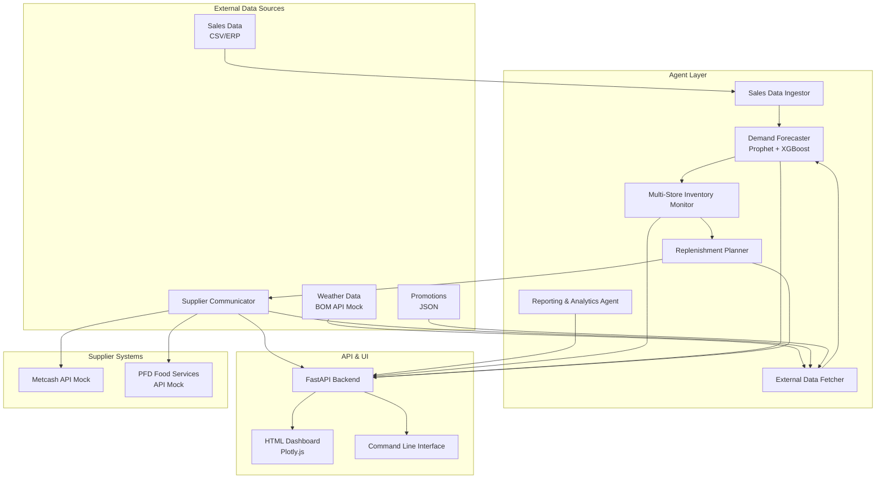

# System Architecture

## Overview

The Retail Demand Forecaster & Auto-Replenishment Agent is a distributed, event-driven system composed of 7 autonomous agents that collaborate to forecast demand, optimize inventory, and automate purchase order generation for Australian retailers.

### High-Level Architecture



## Agent Responsibilities

| Agent | Role | Inputs | Outputs | Key Technologies |
|-------|------|--------|---------|------------------|
| **Sales Data Ingestor** | Ingests and validates historical sales data | CSV files from ERP | Clean Pandas DataFrame | Pandas |
| **External Data Fetcher** | Retrieves weather, holidays, promotions | BOM API (mock), JSON files | Weather df, holiday list, promo list | requests (mock), Pandas |
| **Demand Forecaster** | Predicts future demand per SKU/store | Sales data, external data | Daily demand forecasts with confidence intervals | Prophet, XGBoost |
| **Multi-Store Inventory Monitor** | Tracks stock levels across stores | Sales data, POs, deliveries | Current inventory, low-stock alerts | Pandas |
| **Replenishment Planner** | Generates optimized POs | Forecasts, inventory, supplier data | Purchase orders with bulk discounts | Python optimization |
| **Supplier Communicator** | Sends POs and tracks confirmations | POs, supplier details | PO status, delivery updates | SMTP, requests (mock API) |
| **Reporting & Analytics Agent** | Generates PDF/Markdown reports and visualizations | All operational data | Reports, heatmaps, dashboards | ReportLab, Plotly |

## Data Flow

1. **Ingestion Phase**: Sales data is loaded from CSV, validated, and cached in memory. External data (weather, holidays, promotions) is fetched on-demand from mock sources.

2. **Forecast Phase**: For each SKU+store combination, Prophet models trend + seasonality. XGBoost models residuals using external regressors (temperature, holidays, promotions). Combined forecast yields final predictions.

3. **Inventory Phase**: Current stock levels (mocked from inventory DB) are compared against reorder points to identify low-stock SKUs.

4. **Replenishment Phase**: Low-stock SKUs are aggregated by supplier. Order quantities respect minimums, bulk discounts, and lead times. A consolidated PO is generated per supplier.

5. **Communication Phase**: POs are sent to suppliers via email (SMTP) or mock API. Response tracking is simulated.

6. **Reporting Phase**: Inventory heatmaps, financial metrics, and supplier comparison reports are generated in PDF and Markdown formats.

## Technology Stack

| Layer | Technologies |
|-------|--------------|
| Backend | Python 3.10+, FastAPI, Uvicorn |
| Forecasting | Prophet (time-series), XGBoost (ML) |
| Data Processing | Pandas, NumPy |
| Frontend | HTML5, CSS3, JavaScript (Vanilla), Plotly.js |
| Reports | ReportLab (PDF), Markdown |
| Email | smtplib (SMTP) |
| Testing | Pytest, FastAPI TestClient |
| DevOps | GitHub Actions, Docker, Docker Compose, Kubernetes, Makefile |

## Scalability & Future Extensions

- **Real-time Streaming**: Replace batch sales ingestion with Kafka/Kinesis for real-time sales events.
- **Database Integration**: Replace in-memory DataFrames with PostgreSQL or ClickHouse for persistent storage.
- **Model Persistence**: Save trained Prophet/XGBoost models to disk for faster warm starts.
- **Authentication**: Add OAuth2/JWT for multi-tenant retailer support.
- **Container Orchestration**: Deploy on Kubernetes for auto-scaling and high availability.

## Deployment

### Local Development
```bash
# Using Makefile
make install
make dev
```

### Docker Compose
```bash
make docker-up
```

### Kubernetes
```bash
# Deploy to cluster
make k8s-apply

# Check status
make k8s-status
```

### CI/CD Pipeline
GitHub Actions runs tests on every push. On merge to main:
1. Unit & integration tests (Python 3.10-3.12)
2. Docker image build
3. Kubernetes manifest validation

See `.github/workflows/test.yml` for details.
- **Model Serving**: Deploy Prophet/XGBoost models via MLflow or Seldon for online inference.
- **Database**: Replace CSV with PostgreSQL/TimescaleDB for persistent storage.
- **Authentication**: Add OAuth2/JWT for multi-user access.
- **Supplier APIs**: Integrate real supplier endpoints (Metcash, PFD) using REST/EDI.
- **Caching**: Add Redis for forecast caching to reduce compute load.
- **Containerization**: Dockerize all services for easy deployment.
